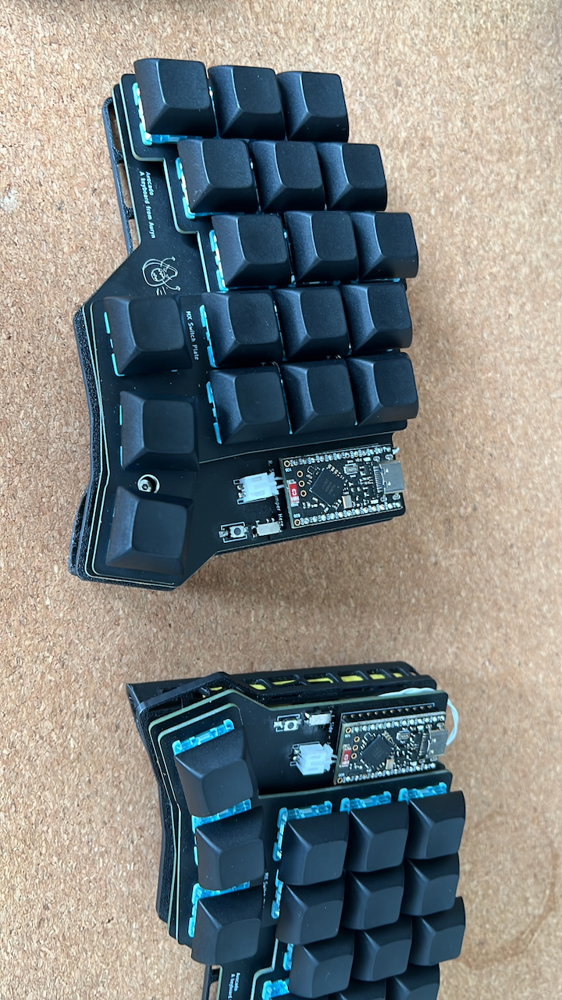

# Avocado Keyboard

The Avocado keyboard is a 34-key split, columnar, ergonomic keyboard. It is designed to be a comfortable and efficient keyboard for everyday use.



## Features

*   **Split, Columnar Layout:** The split design allows you to position the two halves of the keyboard to match your shoulder width, promoting a more natural and comfortable typing posture. The columnar layout aligns the keys with the natural movement of your fingers.
*   **34-Key Layout:** The 34-key layout is a compact layout that is designed to be efficient and easy to learn. It uses layers to provide access to all of the keys that you need.
*   **Hotswap Sockets:** Hotswap sockets allow you to easily change your switches without soldering. This makes it easy to try out new switches and to find the ones that you like best.
*   **Rotary Encoder:** The rotary encoder can be used for a variety of functions, such as scrolling, volume control, and undo/redo.
*   **Wireless:** The Avocado keyboard is a wireless keyboard that uses the Seeed Studio XIAO BLE controller.
*   **ZMK Firmware:** The Avocado keyboard uses the ZMK firmware, which is a powerful and flexible open-source keyboard firmware.

## Hardware

### PCB

The PCB is designed with Ergogen and KiCad. The design files are located in the `ergogen` and `kicad` directories.

*   **MCU:** Seeed Studio XIAO BLE
*   **Switches:** Choc v1
*   **Diodes:** SOD-123W

### Case

The case is a 3D printed case. The design files are not yet available.

### Bill of Materials (BOM)

| Component             | Quantity | Notes                                                                |
| --------------------- | -------- | -------------------------------------------------------------------- |
| Seeed Studio XIAO BLE | 2        |                                                                      |
| Choc v1 Switches      | 34       |                                                                      |
| SOD-123W Diodes       | 34       |                                                                      |
| Hotswap Sockets       | 34       |                                                                      |
| Rotary Encoder        | 1        | EC11 or EC12                                                         |
| Battery               | 2        | 301230 LiPo battery                                                  |
| On/Off Switch         | 2        |                                                                      |
| Reset Switch          | 2        |                                                                      |
| M2 Screws             | 12       | For the case                                                         |
| Keycaps               | 34       |                                                                      |

## Firmware

The Avocado keyboard uses the ZMK firmware. The firmware is located in the `config` directory.

### Building and Flashing

The firmware is built automatically by GitHub Actions. You can download the latest firmware from the [Actions] tab on the GitHub repository.

To flash the firmware, you will need to put your XIAO BLE into bootloader mode. To do this, connect the XIAO BLE to your computer and double-press the reset button. The XIAO BLE will then show up as a USB mass storage device. You can then drag and drop the firmware file onto the XIAO BLE.

## Build Guide

A detailed build guide is not yet available. However, the build process is similar to other custom keyboards. You will need to solder the diodes, hotswap sockets, and other components to the PCB. You will then need to assemble the case and install the keycaps.

## Local Development

### Ergogen

#### Build

This will run Ergogen and build all of the output files.

```bash
npm run ergogen:build
```

#### Watch

This will watch the `config.yaml` file and the `footprints` directory and run the build command whenever there are changes.

```bash
npm run ergogen:watch
```

### ZMK

```sh
# One time setup
git clone https://github.com/zmkfirmware/zmk.git
npm install -g @devcontainers/cli

docker volume create --driver local -o o=bind -o type=none \
  -o device="/Users/auryn/coding/avocado/config" zmk-config
docker volume create --driver local -o o=bind -o type=none \
  -o device="/Users/auryn/coding/avocado/zephyr" zmk-modules
devcontainer up --workspace-folder "/Users/auryn/coding/zmk"

docker exec -w /workspaces/zmk -it a29e880249f3 /bin/bash

cd app
west update
west config build.cmake-args -- "-DSHIELD=avocado_left -DZMK_CONFIG=/workspaces/zmk-config"
west config build.cmake-args -- "-DSHIELD=avocado_right -DZMK_CONFIG=/workspaces/zmk-config"

# One or the other
west build -p -b nice_nano_v2 -- -DSHIELD=avocado_left
# west build -p -b seeeduino_xiao_ble -- -DSHIELD=avocado_left
```

## Acknowledgements

*   [Ergogen](https://github.com/ergogen/ergogen)
*   [Absolem Club Discord](https://discord.gg/nbKcAZB)
*   [V4 Migration Guide](https://github.com/tsteffek/Ergogen-V4-Migration-Guide)
*   [Claw](https://gitlab.com/Audijo/keyboard)
*   [MrKeyboard](https://github.com/MrCarney/mrkeyboard)
*   [Corne keyboard](https://github.com/foostan/crkbd)
*   [ZMK](https://github.com/zmkfirmware/zmk)
*   [Miryoku ZMK](https://github.com/manna-harbour/miryoku_zmk)